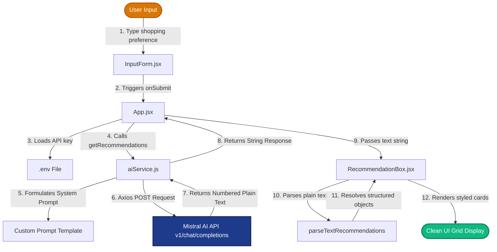

# AI Product Recommendation System

A clean, modular, and responsive product recommendation system built with **React**, **Vite**, **Tailwind CSS v4**, and integrated with the **Mistral AI Chat Completions API** using **Axios**.

---

## 📊 Data Flow Diagram

The diagram below visualizes how user inputs and configuration state flow through the component tree, interact with the API service layer, parse raw text streams, and render structured cards.



---

## 📂 Project Structure

This project adopts a clean, company-style layout separating UI presentation, state orchestration, static data, and network services:

```text
src/
├── components/
│   ├── InputForm.jsx            # Captures and submits user preference inputs
│   └── RecommendationBox.jsx    # Parses raw API text response and renders cards
├── services/
│   └── aiService.js             # Encapsulates Mistral AI API communication (Axios)
├── App.jsx                      # App controller: Coordinates state and views
├── main.jsx                     # Application entry point
└── index.css                    # Main stylesheet loading Tailwind v4
.env                             # Environment configuration (VITE_MISTRAL_API_KEY)
package.json                     # Dependency manifests (React 18, Tailwind v4, Axios)
```

---

## 🛠️ File Responsibilities

### 1. `App.jsx` (Orchestrator)
Manages the global application states (`query`, `recommendation`, `loading`, `error`) and wires child components together.

### 2. `services/aiService.js` (API Client)
Handles asynchronous `POST` requests to Mistral's endpoint (`https://api.mistral.ai/v1/chat/completions`). It uses a custom prompt template to ensure Mistral responds in a structured, numbered format with specifications.

### 3. `components/InputForm.jsx` (Search Form)
Provides a clean, responsive textarea layout using Tailwind styles, capturing user preference details and triggering submissions.

### 4. `components/RecommendationBox.jsx` (Result Viewer & Parser)
Contains a custom regex parser `parseTextRecommendations` that converts Mistral's raw text response into clean objects containing:
* Product Name (renders **bold** and **larger font size**).
* Estimated Price (renders as a clean badge).
* Reason description.
* Spec bullet points (RAM, Storage, Processor, Battery) displayed in a styled grid.

---

## ⚙️ Environment Configuration

1. Create a `.env` file in the root directory.
2. Add your Mistral API Key to the file:
```env
VITE_MISTRAL_API_KEY=your_actual_mistral_api_key_here
```

---

## 🚀 Running the Project

### Development Server
Start the local server for interactive testing:
```bash
npm run dev
```

### Production Build
Build and optimize the application:
```bash
npm run build
```
